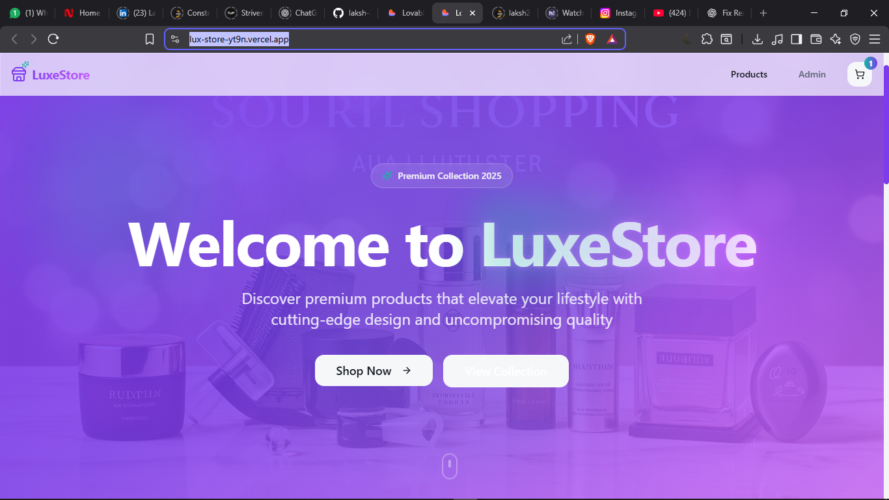
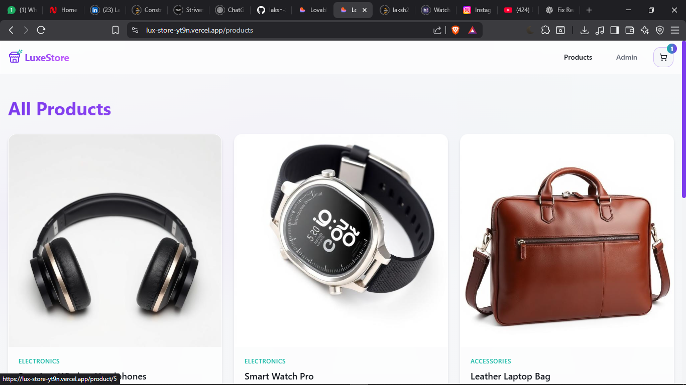
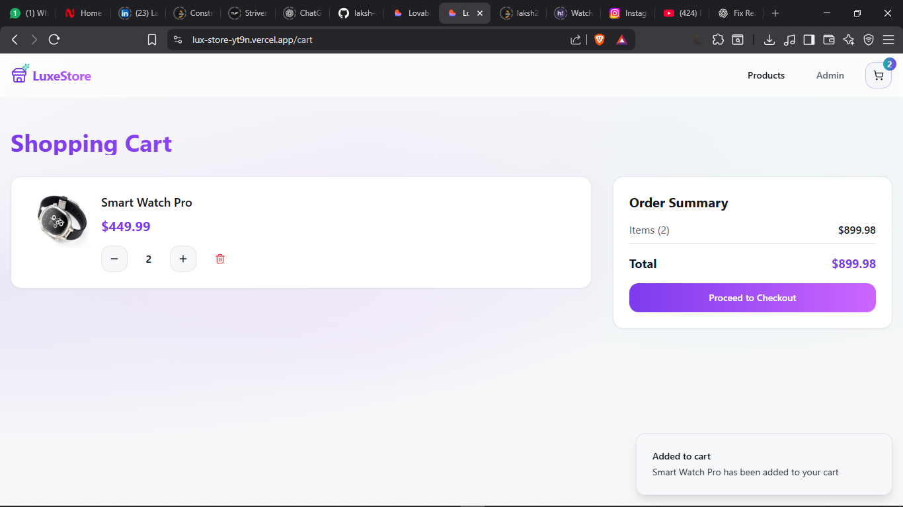
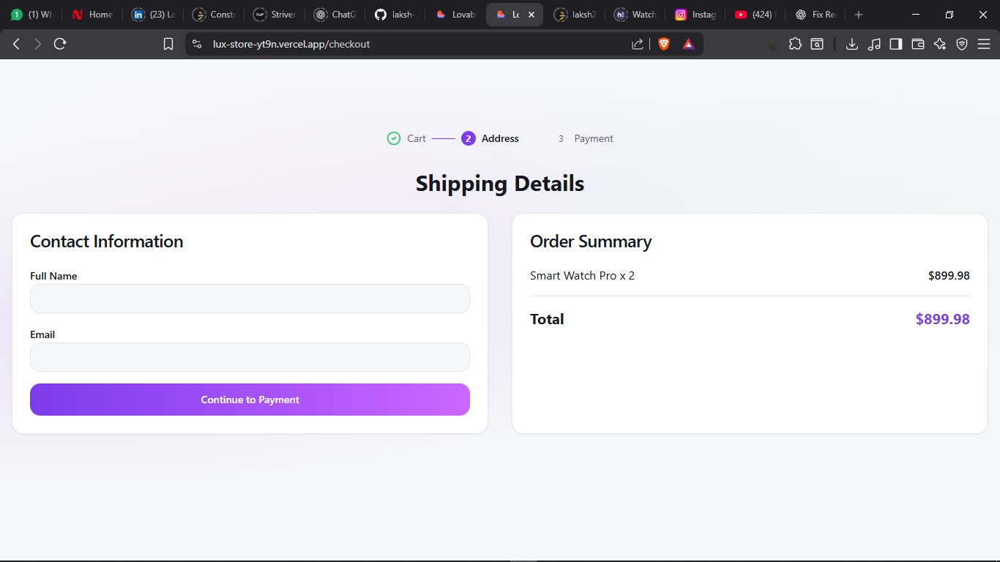
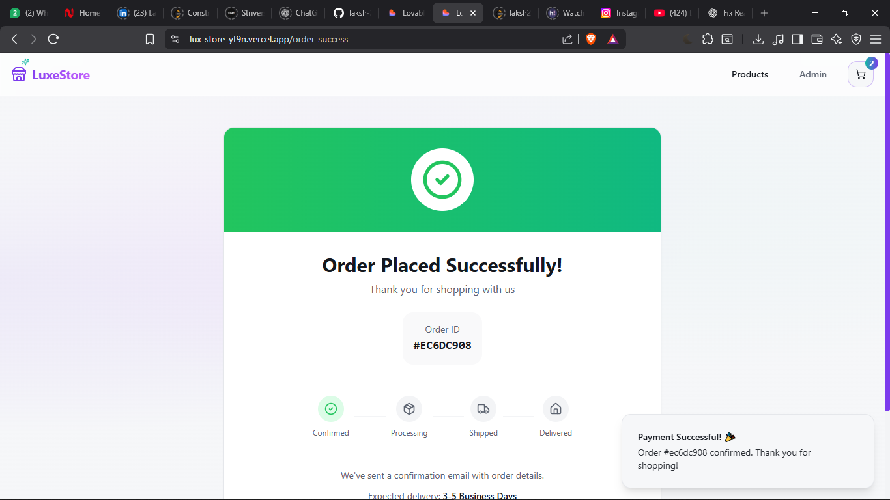

<div align="center">

# 🛍️ LuxeStore  
### Premium E-Commerce Web Application

A modern, responsive e-commerce frontend built with **React, TypeScript, Vite, Tailwind CSS, and shadcn/ui**.

🔗 **Live Demo:** https://lux-store-vt9n.vercel.app  

<br/>


</div>

---

## ✨ Overview

**LuxeStore** is a clean and scalable e-commerce UI that demonstrates real-world frontend practices such as reusable components, global state management, responsive layouts, and a complete cart-to-checkout flow.

This project focuses on **UI/UX quality**, **code organization**, and **production-ready structure**.

---

## 🚀 Features

- 🏠 Premium landing page with gradient hero section
- 🛍️ Product listing with responsive grid layout
- 📄 Product detail pages
- 🧺 Shopping cart with quantity controls
- 💳 Checkout flow (Cart → Address → Payment)
- ✅ Order success & confirmation screen
- 🌗 Theme management using React Context
- 🔔 Toast notifications
- 📱 Fully responsive design
- ⚡ Lightning-fast dev experience with Vite

---

## 🛠️ Tech Stack

| Category | Tech |
|-------|------|
| Frontend | React, TypeScript |
| Styling | Tailwind CSS, shadcn/ui |
| Routing | React Router |
| State | React Context, Hooks |
| Tooling | Vite, ESLint |
| Deployment | Vercel |

---

## 📸 Screenshots

### 🏠 Home Page

> Premium hero section with featured collection badge and CTA buttons.

---

### 🛍️ Products Page

> Clean, responsive product grid with category labels.

---

### 🧺 Shopping Cart

> Cart with quantity management, price calculation, and order summary.

---

### 🚚 Checkout Page

> Multi-step checkout flow with shipping details.

---

### ✅ Order Success

> Order confirmation with status tracking and success notification.

---

## 📂 Project Structure

```txt
src/
├── assets/            # Images & static assets
├── components/        # Reusable UI components
├── context/           # Global context (theme)
├── pages/             # App pages
├── hooks/             # Custom hooks
├── data/              # Mock / static data
├── App.tsx
├── main.tsx
├── index.css
└── vite-env.d.ts
